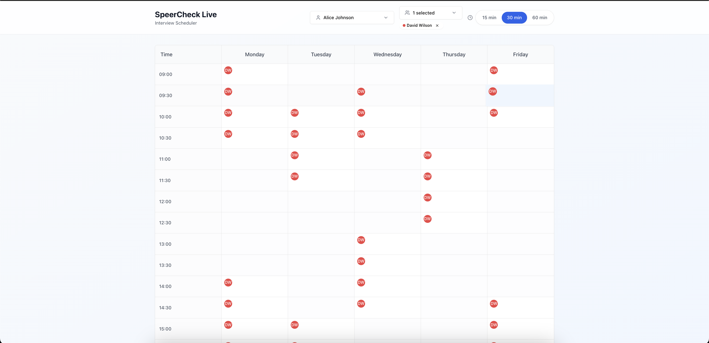
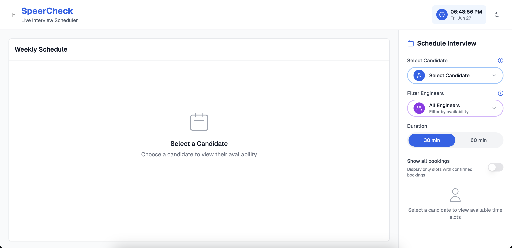
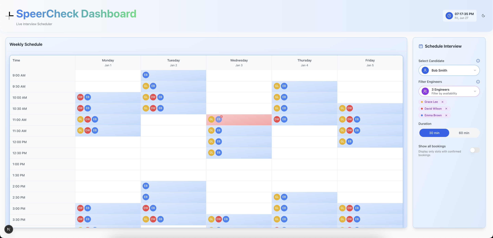

# SpeerCheck Live

**A React & Next.js internal tool** for recruiters to effortlessly schedule candidate interviews based on team availability.

---

## 🚀 Live Demo

🔗 [View Live Demo](https://speercheckinterview.netlify.app/)

---

## 🎥 Demo Walkthrough

Refer to [`DEMO_WALKTHROUGH.md`](https://www.loom.com/share/f64a45972e8846a6989f550bdb6fd3e4?sid=3bc3a922-05fc-4e9f-8754-8c4a85f7fedd) for a full scripted recording flow, including feature shots and unit-test runs.

---

## 📐 Design Iterations

1. **Iteration 1**  
   

   - Initial wireframe with single-color badges and basic calendar grid.

2. **Iteration 2**  
   

   - Added multi-engineer color coding, hover tooltips, and duration toggle.

3. **Final Iteration**  
   
   - Refined UX with conflict-resolution modals, full availability views, and dark mode support.

---

## ⚙️ Core Features

- **Dynamic Calendar Grid**

  - Monday to Friday, 9 AM–6 PM with 30 / 60-minute slot options.

- **Availability Intersection**

  - Displays only slots shared by the selected candidate and engineers.

- **Booking Flow**

  1. Empty state: prompts to “Select a candidate first.”
  2. Confirmation modal showing candidate, engineer, date/time, duration, and format.
  3. Booked slots locked with a red badge and lock icon, plus hover popup details.
  4. Conflict-resolution modal with auto-suggested alternative time slots.

- **Full Availability Overviews**

  - “ℹ️” icon opens modal showing candidate or engineer’s full availability window.

- **Filter: Show Only Bookings**

  - Toggle to display confirmed interviews only.

- **Light & Dark Mode**
  - Instant toggle via the top-right UI switch.

---

## 🛠️ Tech Stack

- **Framework**: Next.js v15, React v19, TypeScript
- **Styling**: Tailwind CSS, Radix UI primitives
- **Forms & State**: React Hook Form, VAUL (local JSON)
- **Date Handling**: date-fns
- **Components**: Lucide-React, cmdk, Recharts
- **Animation**: tailwindcss-animate, embla-carousel
- **Testing**: Jest, React Testing Library

---

## ⚡ Getting Started

1. Clone & Install
   git clone git@github.com:yourorg/speercheck.git
   cd speercheck
   npm install

2. Run Locally
   npm run dev
   then open http://localhost:3000

3. Build & Start
   npm run build
   npm run start
   ✅ Running Tests
   npm test

🧪 Test coverage includes:

- Candidate availability modal
- Engineers accordion view
- Modal open/close callbacks
- Conflict-resolution logic

📦 Deployment
Configured for Vercel or Netlify:
Push to main → automatic deployment.
Ensure required environment variables are set in your hosting dashboard.

🤝 Contributing
Fork the repository
Create a feature branch:
git checkout -b feat/your-feature
Commit your changes:
git commit -m "feat: add your feature"
Push & open a Pull Request
Please ensure all tests pass locally before merging.

📄 License
MIT © Ashish Patel
